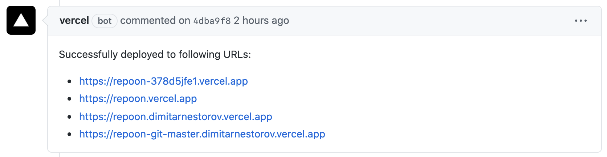

# Repo on Vercel

This is a Cydia/APT repository template built for the [Vercel platform](https://vercel.com/). This is a [Next.js](https://nextjs.org/) project.

## Why Repo on Vercel?

Repo on Vercel is aimed to make possible downloading packages directly from GitHub Releases which has a download counter unlike GitHub Pages.

## Getting Started

<p align="center"><a href="https://github.com/dimitarnestorov/RepoOnVercel/generate"></a></p>

### Run the development server

#### Install Node.js

To build and run this repo locally you need Node.js: https://nodejs.org/

You can install it using [Homebrew](https://brew.sh/) on macOS: `brew install node`

You can install it using [Chocolatey](https://chocolatey.org/) on Windows: `choco install nodejs`

#### Install the dependencies

Run the following in the root folder of your repo:

```sh
npm install
```

#### Run the server

```bash
npm run dev
```

### Edit the repository metadata

Edit the `exports.name` and `exports.description` strings in the `repo.js` file.

### Replace `CydiaIcon.png` and `favicon.ico` with your own

Icons are located in the `public` folder. They are visible in package managers and on the web.

### Add your packages

Insert your GitHub Releases package URLs in the `exports.packages` array in the `repo.js` file.

### Add your depictions

Depictions live in the `pages` folder. The format for the file name is `name.js` where `name` is the name of your package. To view your depictions before deploying run the development server and visit `http://localhost:3000/name` where `name` is the name of your package.

If your package name has spaces in it replace those with `-` for the depiction file.

### Add your package icons

Put your icons in the public folder and then edit the `exports.icons` object in the `repo.js` file. The key is the name of your package, the value is the path of the icon without `public`.

### Modify the home page

Modify `index.js` in the `pages` folder, [run the development server](#run-the-development-server), and open [http://localhost:3000](http://localhost:3000) in your browser to see the result.

### Deploy on Vercel

After you've created your repo click [here to import](https://vercel.com/import) your repo on Vercel. Choose "Import Git Repository" and enter the URL of your Git repository.

## Increase rate limit (fix "Error: rate limit exceeded")

This template uses the GitHub API to cache requests. The GitHub API is limited to 60 unauthenticated requests per IP address per hour. To increase this limit you need to specify a GitHub token as an environment variable (`GITHUB_TOKEN`) when running `npm run dev`. To get a token go to [Settings -> Developer settings -> Personal access tokens](https://github.com/settings/tokens) and click "Generate new token". If you experience `rate limit exceeded` when deploying to Vercel you need to specify a GitHub token as an environment variable in your project settings.

```sh
GITHUB_TOKEN=d107d6aaf3a6b550ebeead351a3974cb8b262b74 npm run dev
```

## Disable Vercel comments

<p align="center"></p>

By default Vercel for GitHub will comment on commits and pull requests when it successfully deploys your repo. This can be disabled by setting `github.silent` to `true` in your Vercel configuration (add `vercel.json` in the root of your repository). [Reference](https://vercel.com/docs/configuration#git-integrations/github-silent).

## Notes

-   If you reupload a package with the same name and tag (resulting with a URL that is already in `repo.js`) you will need to redeploy your repo or restart your development server

## Join [The Community Repo](https://repo.community/)

To become a part of The Community Repo add a file in the `public` folder called `repo_community_validation.txt` with the following contents:

```
community.repo.access: allow_forwarding_all
```

Visit the [Add Your Repo](https://repo.community/add) page, fill out the form at the bottom of the page, and click Submit.

## Repositories using this template

-   [https://dimitarnestorov.com/](https://dimitarnestorov.com/) ([Source code](https://github.com/dimitarnestorov/website))
-   [https://yulkytulky.com/](https://yulkytulky.com/) ([Source code](https://github.com/YulkyTulky/Repo))
